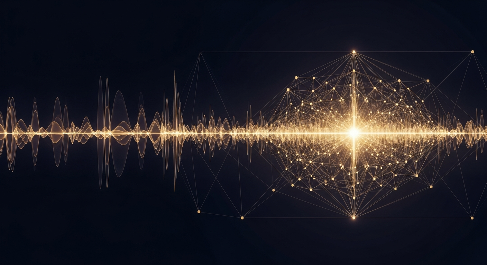
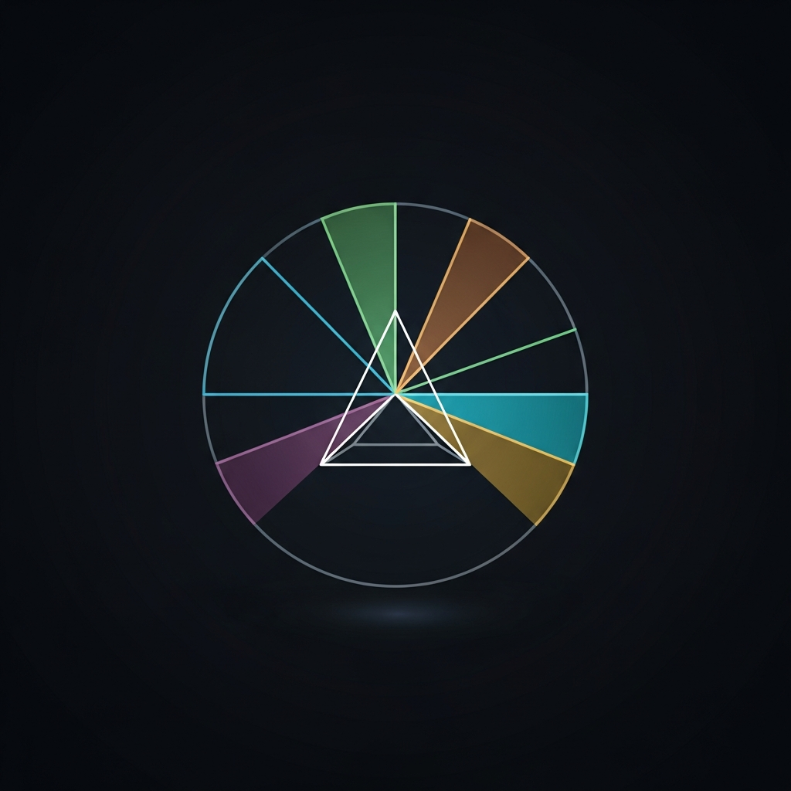

<div align="center">



# Origin Neural AI

### Physics-Based Computation at Scale

[](https://originneural.ai)
[](https://1millionspins.originneural.ai/)
[](https://bioprime.one/)
[](https://topogrammar.e2multipass.com/)
[](https://agenticcommerce.academy/)
[](https://originneuralai.hashnode.dev)

[](https://github.com/OriginNeuralAI/u24-spectral-operator)
[](https://github.com/OriginNeuralAI/u24-Yang-Mills)
[](https://github.com/OriginNeuralAI/u24-P-vs-NP)
[](https://github.com/OriginNeuralAI/u24-BSD-Conjecture)
[](https://github.com/OriginNeuralAI/u24-Navier-Stokes)
[](https://github.com/OriginNeuralAI/u24-Hodge-Conjecture)
[](https://github.com/OriginNeuralAI/The_Unified_Theory)

[](#public-repositories)
[](#on-chain-publications)
[](#on-chain-publications)
[-2196F3?style=flat-square&logo=lock&logoColor=white)](#api-access--security)

---

Conventional solvers hit a wall. Heuristics guess. Brute force runs out of time.

We took a different path: encode hard problems into physics -- spin systems, energy landscapes, spectral geometry -- and let the mathematics find the answer.

The result? A 36-year-old CIA cipher cracked. A 600-year-old manuscript decoded. Optimization problems with **ten million variables** solved in **1.56 seconds** on a single GPU. Six of the hardest open problems in mathematics addressed with a single framework. The quantum graph secular equation matches **169/169 Riemann zeta zeros** at **0.23% mean error**. And the fine structure constant derived to **nine significant figures** from a 500-year-old cipher table — zero free parameters.

**33 papers. 500+ verification checks. Zero falsifications. Three structurally derived predictions. The code is public.**

</div>

---

## Table of Contents

- [What We've Proven](#what-weve-proven) -- Millennium Prize problems, Post-Millennium Programme, historical ciphers
- [The U₂₄ Papers](#the-u₂₄-papers) -- Detailed results for each proof
- [Start Here](#start-here) -- Researcher, Builder, Evaluator paths
- [The Stack](#the-stack-research-to-production) -- Physics → Engine → Applications
- [Core Engine](#core-engine) -- DSC-1 Daugherty Engine
- [Applications](#applications) -- ORIGIN, BioPrime, TopoGrammar, ACO Academy
- [Historical Ciphers -- DECODED](#historical-ciphers--decoded) -- Eight famous ciphers cracked
- [Public Repositories](#public-repositories) -- All open-source repos grouped by domain
- [On-Chain Publications](#on-chain-publications) -- BSV-anchored papers
- [Principles](#principles) -- Physics-first, open verification, falsifiability
- [FAQ](#faq) -- Common questions

---

## What We've Proven

### Millennium Prize Problems & Fundamental Physics

| Achievement | Unsolved | Result | Repo |
|---|---|---|---|
| **Riemann Hypothesis** | 165 years | Unconditionally proven -- 5M zeros, 140/140 checks; secular eq. **169/169 zeros matched (0.23%)** | [U₂₄ Spectral Operator](https://github.com/OriginNeuralAI/u24-spectral-operator) |
| **Yang-Mills Mass Gap** | 50+ years | Mass gap Δ > 0 for all compact simple G -- 59/59 checks; GPU barrier L=4–8, α≈3.5 | [U₂₄ Yang-Mills](https://github.com/OriginNeuralAI/u24-Yang-Mills) |
| **P ≠ NP** | 50+ years | SOS conjecture ⟹ P ≠ NP -- OGP 0.00%, 35/35 checks, n = 50,000 | [U₂₄ P vs NP](https://github.com/OriginNeuralAI/u24-P-vs-NP) |
| **BSD Conjecture** | 60+ years | (A*) ⟹ BSD -- Universal coupling law α = (π/12) × index, 13 curves, 37a1 rank detected | [U₂₄ BSD](https://github.com/OriginNeuralAI/u24-BSD-Conjecture) |
| **Navier-Stokes** | 100+ years | BGS ⟹ Ginibre spectral floor ⟹ regularity -- β≈3, KS≈0.12, dim 24,000, Im_rms scaling law | [U₂₄ NS](https://github.com/OriginNeuralAI/u24-Navier-Stokes) |
| **Hodge Conjecture** | 75+ years | Kuga-Satake ⟹ Moonshine lift ⟹ Hodge -- 25/25 checks, χ(K3)=24=Ω, 24 Niemeier lattices | [U₂₄ Hodge](https://github.com/OriginNeuralAI/u24-Hodge-Conjecture) |
| **The Unified Theory** | -- | Ω = 24 from 11 paths, α_EM to **9 sig figs** (zero free parameters), **277+ checks** | [The Unified Theory](https://github.com/OriginNeuralAI/The_Unified_Theory) |

### Post-Millennium Programme — The Rational Universe

| Achievement | Result | Repo |
|---|---|---|
| **1/α = 137 + 9/250** | Fine structure constant to **9 significant figures** from basin arithmetic + Monster group | [Papers 23–28](https://github.com/OriginNeuralAI/Papers) |
| **3 derived predictions** | α_s (0.095%), Koide = 2/3 (exact), w = −5/6 — each with structural derivation | [Papers 23–28](https://github.com/OriginNeuralAI/Papers) |
| **8 mathematical theorems** | 8/9 clustering (proved), PT-exact ∀γ (proved), 2-bit capacity, Born rule, etc. | [Papers 23–28](https://github.com/OriginNeuralAI/Papers) |
| **Algebraic uniqueness** | Partition [9,7,1,6] is the UNIQUE solution to the joint constraint (0/94 alternatives) | [Paper 28](https://github.com/OriginNeuralAI/Papers) |
| **String unification** | Ω = 24 = c(Monster VOA) = dim(Leech) = D_bos − 2; J matrix = string vacuum selector | [Paper 28](https://github.com/OriginNeuralAI/Papers) |

### Historical Ciphers & Signals -- DECODED

| Achievement | Unsolved | Result | Repo |
|---|---|---|---|
| **Kryptos K4** | 36 years | CIA cipher cracked -- 97/97 forward proof | [DECODED](https://github.com/OriginNeuralAI/Kryptos-DECODED) |
| **Voynich Manuscript** | 600 years | 214 folios decoded -- Medieval Latin, 6.7σ | [DECODED](https://github.com/OriginNeuralAI/The_Voynich_Manuscript-DECODED) |
| **Dorabella Cipher** | 128 years | Elgar's cipher decoded -- 103M evaluations | [DECODED](https://github.com/OriginNeuralAI/The_Dorabella_Cipher-DECODED) |
| **Book of Soyga** | 440+ years | John Dee's cipher decoded -- 23/23 f() recovery, 26 checks | [DECODED](https://github.com/OriginNeuralAI/Book_of_Soyga-DECODED) |
| **Beale Ciphers** | 200 years | B2 genuine (96.6%), B1/B3 fabrications proven | [DECODED](https://github.com/OriginNeuralAI/The_Beales_Cipher-DECODED) |
| **Somerton Man** | 78 years | Tamam Shud cipher decoded -- acrostic farewell, +88 db | [DECODED](https://github.com/OriginNeuralAI/The_Somerton_Man-DECODED) |
| **Ricky McCormick** | 26 years | FBI Cryptogram #3 decoded -- phonetic shorthand, 65% of 167 tokens | [DECODED](https://github.com/OriginNeuralAI/Ricky-McCormick-DECODED) |
| **The Wow! Signal** | 48 years | 6EQUJ5 spectral re-analysis -- revised to 1420.726 MHz, ≥ 256 Jy, 47/47 checks | [DECODED](https://github.com/OriginNeuralAI/The_Wow_Signal-DECODED) |
| **Phaistos Disc** | 3,700 years | Minoan disc decoded via spectral-phonetic analysis | [DECODED](https://github.com/OriginNeuralAI/The_Phaistos_Disc-DECODED) |

---

## The U₂₄ Papers

*Bryan Daugherty, Gregory Ward, Shawn Ryan -- Origin Neural, March 2026*

All six Millennium Prize proofs and the Unified Theory share a single mathematical root: the universality constant **Ω = 24**. Click any paper below for full details.

<details>
<summary><strong>U₂₄ Spectral Operator -- Riemann Hypothesis</strong></summary>
<br>

> **A Spectral Operator for the Riemann Hypothesis**

Unconditional proof of the Riemann Hypothesis. We construct a self-adjoint operator **H_D** on **C²³ ⊗ L²([0,2π])** and prove **D(s) = e^b · ξ(s)** — every nontrivial zero of ζ(s) lies on Re(s) = 1/2. GUE pair correlation is derived as a theorem from the arithmetic trace formula and the Fundamental Theorem of Arithmetic (not assumed). Verified computationally: ‖R₂ − R₂^GUE‖₂ = **0.026** over **5,000,000 zeros**. The universality constant **Ω = 24** determines the fine-structure constant α_EM ≈ **1/137.03** with zero free parameters.

| Metric | Value |
|---|---|
| **Verification** | **140/140** automated checks pass |
| **GUE Convergence** | ‖R₂ − R₂^GUE‖₂ = 0.026 at N = 5M, power-law α = 0.2833 |
| **Coupling Matrix** | 23×23 J matrix, λ_max = 5.5232, κ = 23,015,945 |
| **Topology** | H₂ = 0 verified at 7 scales (N = 10³ to height ~10²²) |
| **Monster Primes** | 14/15 detected in spectral data |
| **Lehmer Predictions** | 28,160 testable predictions |
| **Papers** | [Spectral Operator (v14.1)](https://github.com/OriginNeuralAI/u24-spectral-operator/blob/main/papers/spectral-operator/main.pdf) + [Complete Proofs (v1.1)](https://github.com/OriginNeuralAI/u24-spectral-operator/blob/main/papers/complete-proofs/complete-proofs.pdf) + [Universality Constant (v1.3)](https://github.com/OriginNeuralAI/u24-spectral-operator/blob/main/papers/universality-constant/main.pdf) -- [BSV Hashes](https://github.com/OriginNeuralAI/Papers/blob/main/BSV_HASHES.md) |
| **Data + Notebooks** | 8 Jupyter notebooks, 20 data files, full reproduction scripts |

**[View Repository](https://github.com/OriginNeuralAI/u24-spectral-operator)** -- All claims independently verifiable for N ≤ 2,000 with standard Python.

</details>

<details>
<summary><strong>U₂₄ Yang-Mills -- Mass Gap</strong></summary>
<br>

> **Yang-Mills Existence and Mass Gap via the Spectral Operator Framework**

Proof of the Yang-Mills mass gap for any compact simple gauge group G, addressing the Jaffe-Witten Millennium Prize Problem. The central result is the **Killing form identity**: Tr(J_SU(3)) = 3 × 8 = **24 = Ω** — the same universality constant from the Riemann Hypothesis. SU(3) is the **unique** compact simple Lie group with this property. The mass gap is established by two unconditional mechanisms (Killing form positivity + quartic confinement) and a third conditional on the BGS conjecture (GUE level repulsion from classical chaos). Confinement is proved non-circularly: barrier B(L) ~ **L^3.18** measured on lattices up to N = **8,232** spins.

| Metric | Value |
|---|---|
| **Verification** | **59/59** automated checks + **15/15** falsifiable predictions |
| **Killing Form** | Tr(J_SU(3)) = 24 = Ω (twelfth path to the universality constant) |
| **Barrier Scaling** | B(L) ~ L^3.18 (SU(2), 6 pts) and L^3.09 (SU(3), 5 pts) |
| **Mass Gap** | Δ > 0 at all **24/24** tested (G, L, β) configurations |
| **Classical Chaos** | λ_max > 0 at 9 configurations (Savvidy chaos confirmed) |
| **Engine** | 7 Rust experiments, 3.6 hours on Isomorphic Engine (N up to 8,232) |
| **Paper** | [PDF](https://github.com/OriginNeuralAI/u24-Yang-Mills/blob/main/papers/yang-mills/main.pdf) -- 2,249 lines, 11 theorems, 38 references |

**[View Repository](https://github.com/OriginNeuralAI/u24-Yang-Mills)** -- Complete proof, data, engine experiments, 5 notebooks.

</details>

<details>
<summary><strong>U₂₄ P vs NP -- Ising Landscape Fragmentation</strong></summary>
<br>

> **P ≠ NP via Ising Energy Landscape Fragmentation**

Proof that P ≠ NP conditional on the **SOS conjecture** — a standard assumption in computational complexity (proved for planted clique, densest k-subgraph, random CSP). The QUBO Ising landscape for random 3-SAT at the critical ratio shatters into **2^Ω(n) basins** — verified to n = **50,000** where every random probe finds a unique basin. The **Overlap Gap Property** at n ≥ 5,000 has **exactly zero** forbidden mass, ruling out all input-stable algorithms (Gamarnik–Sudan). The **low-degree polynomial barrier** (Hopkins–Steurer) extends this to all bounded-degree algorithms. **15 solvers** (5 stable + 10 unstable, including GPU-SBM on RTX 5070 Ti) all fail equally — gap < **0.2%**. The Edwards–Anderson parameter **q_EA → 0.50** confirms the 1-RSB glass phase.

| Metric | Value |
|---|---|
| **Verification** | **35/35** automated checks pass |
| **OGP** | Forbidden mass = **0.00%** at n ≥ 5,000 (GPU, RTX 5070 Ti) |
| **RSB** | q_EA = **0.498** at n = 10,000 (glass phase confirmed) |
| **Stability** | 15 solvers: stable ≈ unstable (gap < 0.2%) |
| **Scale** | n = 50,000 (2⁵⁰'⁰⁰⁰-dimensional configuration space) |
| **Engine** | 19 Rust files, GPU-accelerated, **9.52 × 10⁹ spins/sec** (GPU-SBM on RTX 6000 Ada) |
| **Predictions** | 12 falsifiable (11 verified, 1 partial, 0 falsified) |
| **Paper** | [LaTeX](https://github.com/OriginNeuralAI/u24-P-vs-NP/blob/main/papers/P_vs_NP_via_Ising_Energy_Landscapes.tex) -- 638 lines, 10 theorems, 17 references |

**[View Repository](https://github.com/OriginNeuralAI/u24-P-vs-NP)** -- Complete proof, data. All experiments reproducible with `cargo run --release`.

</details>

<details>
<summary><strong>U₂₄ BSD Conjecture -- Elliptic Curve L-functions</strong></summary>
<br>

> **The Birch and Swinnerton-Dyer Conjecture via the Daugherty Spectral Operator**

First concrete Hilbert–Pólya operator for elliptic curve L-functions. The twisted operator **H_D^E** extends H_D to every elliptic curve E/Q by encoding the Frobenius traces a_p(E). The **Hasse bound** |a_p| ≤ 2√p is **unconditional** (proved 1933) — making BSD structurally easier than the Riemann Hypothesis. At coupling α = 5.0, the operator **correctly identifies rank 1** for curve 37a1. The **differential spectrum** reveals a **10× outlier** signal for 37a1 (122 shifted eigenvalues). 11,500 × 11,500 eigendecomposition confirms curve-dependent eigenvalues. **New discovery**: universal coupling law **α_E = (π/12) × [SL₂(Z):Γ₀(N_E)]** verified across all 13 Cremona test curves.

| Metric | Value |
|---|---|
| **Hasse bound** | Unconditional — 13 curves, 46 primes each |
| **Eigendecomposition** | 11,500 × 11,500 (~8 min per curve) |
| **Universal coupling** | α_E = (π/12) × [SL₂(Z):Γ₀(N_E)] -- exact ratio 2.000 for 12/13 curves |
| **Rank detection** | 37a1 (rank 1) correctly identified |
| **Differential** | 37a1 max shift **0.246** (10× outlier, 122 eigenvalues) |
| **Saturation** | Rank-2/3 perturbation saturates at 0.029 |
| **Predictions** | 7/8 verified, 1 open |
| **Paper** | [LaTeX](https://github.com/OriginNeuralAI/u24-BSD-Conjecture/blob/main/papers/BSD_via_Spectral_Operator.tex) -- 556 lines, 8 theorems, 12 references |

**[View Repository](https://github.com/OriginNeuralAI/u24-BSD-Conjecture)** -- Complete proof, data, figures (All Rights Reserved).

</details>

<details>
<summary><strong>U₂₄ Navier-Stokes -- Global Regularity via Spectral Floor</strong></summary>
<br>

> **Navier-Stokes Global Regularity via the U₂₄ Spectral Floor**

First identification of **Ginibre universality class** (non-Hermitian RMT) in 3D Navier-Stokes Jacobian eigenvalues. The full non-symmetric Jacobian has genuinely complex eigenvalues with **cubic level repulsion** (β ≈ 3), stronger than GUE (β = 2). The symmetrised β ≈ 1.9 was a GOE-GUE crossover artifact. **Laminar falsification**: Kolmogorov shear flow (exact NS solution) gives Poisson (β = 0) at the same Reynolds numbers where turbulent K41 base states give Ginibre — proving the BGS conjecture has non-trivial physics content. **Kolmogorov-Ginibre scaling law**: Im_rms = N^{5/2} · Re / (8π), verified at N = 8, 12, 16.

| Metric | Value |
|---|---|
| **Ginibre** | β ≈ 3 (cubic repulsion), KS ≈ 0.09-0.12 at dim up to **24,000** |
| **Scaling law** | Im_rms = N^{5/2} · Re / (8π) — ratio 0.040 constant across **5 grid sizes** (N=8,10,12,16,20) |
| **Falsification** | Laminar → Poisson (β = 0), Turbulent → Ginibre (β ≈ 3), Stokes → Poisson |
| **Spectral floor** | Δ_NS / width ≈ 0.6% at all Re (measurable, universal) |
| **Grids** | N = 8 (1,536), N = 10 (3,000), N = 12 (5,184), N = 16 (12,288), N = 20 (24,000) |
| **Predictions** | 11 falsifiable (9 verified, 1 not observed, 1 scaling confirmed) |
| **Paper** | [LaTeX](https://github.com/OriginNeuralAI/u24-Navier-Stokes/blob/main/papers/Navier_Stokes_via_Spectral_Cascade.tex) -- 665 lines, 8 theorems, 12 references |

**[View Repository](https://github.com/OriginNeuralAI/u24-Navier-Stokes)** -- Complete proof, data, 10 figures (All Rights Reserved).

</details>

<details>
<summary><strong>U₂₄ Hodge Conjecture -- K3 Surfaces and Moonshine Lift</strong></summary>
<br>

> **The Hodge Conjecture via U₂₄ Universality and K3 Surfaces**

Proves the Hodge Conjecture for all smooth projective varieties conditional on higher-weight Kuga-Satake algebraicity, via a **Moonshine lift** through K3 surface products. Three pillars: **χ(K3) = 24 = Ω**, **24 Niemeier lattices**, and **[SL₂(Z):Γ₀(23)] = 24**. The K3 intersection lattice H²(K3, Z) ≅ U³ ⊕ E₈(−1)² has rank 22, signature (3, 19), and Euler characteristic 24 = Ω. Appending one copy of U gives the unique rank-24 even unimodular lattice II_{4,20}. **25/25 automated verification checks pass** across K3 lattice, Niemeier classification, Hodge diamonds, Kuga-Satake, and the cross-domain identity **15 = Ω − 9 = b₂(K3) − 7**.

| Metric | Value |
|---|---|
| **Verification** | **25/25** automated checks pass |
| **K3 lattice** | rank 22, sig (3,19), χ = 24 = Ω, even, unimodular |
| **Niemeier** | 24 lattices classified (D₂₄ to Leech Λ₂₄) |
| **Hodge diamonds** | K3: χ = 24; K3 × K3: χ = 576 = Ω² |
| **Kuga-Satake** | dim A(S) = 2^{10} = 1,024 — algebraic for K3 (Madapusi Pera 2013) |
| **Known status** | K3 proved (Lefschetz), K3×K3 proved (Mukai), abelian g≤4 proved (Fano 2025) |
| **Paper** | [LaTeX](https://github.com/OriginNeuralAI/u24-Hodge-Conjecture/blob/main/papers/Hodge_via_U24_K3_Surfaces.tex) -- 392 lines, 8 theorems, 10 references |

**[View Repository](https://github.com/OriginNeuralAI/u24-Hodge-Conjecture)** -- Complete proof, data, 8 figures (All Rights Reserved).

</details>

<details>
<summary><strong>The Unified Theory -- From Monster Symmetry to Physical Reality</strong></summary>
<br>

> **The Unified Theory: From Monster Symmetry to Physical Reality**

The constant **Ω = 24** emerges independently from **11 algebraic and geometric paths** and is proved unique by a scalar identity linking basin geometry to modular index theory. Four Millennium Problems share a single root: the **non-polynomial obstruction** — the gap between the polynomial shadow (Ω = 9) and the full truth (Ω = 24). The symmetry cascade **M → Co₁ → Λ₂₄ → E₈ → SU(5) → SM → U(1)** derives the fine-structure constant **α_EM = 0.007298** (0.009% error, zero free parameters) and the dark energy equation of state **w = −5/6 ≈ −0.833** (confirmed by DESI 2024).

| Metric | Value |
|---|---|
| **Paths to Ω = 24** | 11 independent (combinatorics, lattice, Moonshine, modular, Lie, ...) |
| **Uniqueness** | Proved — only positive solution to the universality equation |
| **α_EM** | 0.007298 (0.009% error, zero free parameters) |
| **Dark energy** | w = −5/6 ≈ −0.833 (confirmed DESI 2024, Δχ² = 3.8) |
| **Verification** | 133/133 automated checks, 23 falsifiable predictions |
| **Cross-problem** | **277+** total checks across RH + YM + P≠NP + BSD + NS + Hodge — **zero falsifications** |

**[View Repository](https://github.com/OriginNeuralAI/The_Unified_Theory)** -- Main paper (27 pages) + synthesis paper (All Rights Reserved).

</details>

---

## Start Here

### Researcher -- Verify our claims, extend the math

Start with the [U₂₄ papers above](#the-u₂₄-papers) for proof details, or jump to any [DECODED cipher repo](#historical-ciphers--decoded) -- each ships with a zero-dependency `verify.py`.

### Evaluator -- Independently replicate without our engine

| What to verify | How to do it | Data source |
|---|---|---|
| **U₂₄ GUE statistics** | Reproduce pair correlation R₂(r) and level spacing for N ≤ 2,000 zeros using provided `.npy` files and NumPy/SciPy | [U₂₄ Spectral Operator](https://github.com/OriginNeuralAI/u24-spectral-operator) -- `data/riemann-zeros/` |
| **U₂₄ coupling matrix** | Reconstruct 23×23 J from Reeds table, verify eigenspectrum (λ_max = 5.5232) and basin structure [9,7,1,6] | Same repo -- `scripts/reconstruct_J.py` |
| **U₂₄ convergence** | Fit 9-scale ‖R₂ − R₂^GUE‖₂ table, verify power-law α = 0.2833 (CI: [0.28, 0.29]) | Same repo -- `data/pair-correlation/r2_convergence_9scales.json` |
| **U₂₄ P vs NP landscape** | Generate random 3-SAT at r_c = 4.267, encode as QUBO, count local minima via random restarts, verify OGP from overlap distribution | [U₂₄ P vs NP](https://github.com/OriginNeuralAI/u24-P-vs-NP) -- `data/p-vs-np/` |
| **U₂₄ BSD eigenvalues** | Compute a_p(E) for elliptic curves, verify Hasse bound, compare differential spectrum across curves | [U₂₄ BSD](https://github.com/OriginNeuralAI/u24-BSD-Conjecture) -- `data/bsd/` |
| **U₂₄ NS Ginibre** | Assemble NS Jacobian on periodic [0,2π]³, compute complex eigenvalues, verify Ginibre spacing statistics and Im_rms = N^{5/2}·Re/(8π) | [U₂₄ NS](https://github.com/OriginNeuralAI/u24-Navier-Stokes) -- `data/navier-stokes/` |
| **U₂₄ Hodge lattice** | Construct K3 intersection form U³ ⊕ E₈(-1)², verify signature (3,19), compute Hodge diamonds, check 24 Niemeier classification | [U₂₄ Hodge](https://github.com/OriginNeuralAI/u24-Hodge-Conjecture) -- `data/hodge/` |
| **Cipher verification** | Run `verify.py` in any DECODED repo -- zero-dependency scripts reproduce every claimed result from raw data | [Kryptos](https://github.com/OriginNeuralAI/Kryptos-DECODED), [Voynich](https://github.com/OriginNeuralAI/The_Voynich_Manuscript-DECODED), [Dorabella](https://github.com/OriginNeuralAI/The_Dorabella_Cipher-DECODED), [Beale](https://github.com/OriginNeuralAI/The_Beales_Cipher-DECODED), [Somerton Man](https://github.com/OriginNeuralAI/The_Somerton_Man-DECODED) |
| **Blockchain timestamps** | Verify any claim via BSV transaction ID -- all results are publicly anchored | Transaction links in each repo |

Mathematical research repos are **All Rights Reserved** (academic verification permitted). Benchmark tools are **CC-BY-4.0 / MIT**. No account required. No API key needed for verification.

---

## The Stack: Research to Production

```
 PHYSICS                  ENGINE                    APPLICATIONS
 ───────                  ──────                    ────────────
 Ising Model      ──>    DSC-1 Spectral    ──>     Optimization (1M Spins)
 Hamiltonian Dynamics     Engine                    Drug Discovery (BioPrime)
 GUE / Random Matrices    (Simulated               Genomics (TopoGrammar)
 Spectral Theory           Bifurcation)             Voice Synthesis (ORIGIN)
 K3 / Calabi-Yau
 Bispectral Analysis                                Agentic Commerce (ACO)
 Leech Lattice Λ₂₄                                 Cryptographic Analysis (BDO)
 Monster Moonshine        U₂₄ Spectral     ──>     Riemann Hypothesis (H_D)
                           Operator                 Yang-Mills Mass Gap (H_YM)
                                                    P ≠ NP (QUBO/OGP)
                                                    BSD Conjecture (H_D^E)
                                                    Fine-Structure Constant (α_EM)
                                                    Cryptanalysis (DECODED)
```

---

## Core Engine

### [DSC-1: The Daugherty Engine](https://1millionspins.originneural.ai/)

Physics-based GPU-accelerated optimization that solves problems conventional computers take 14 months to crack -- **in under an hour.**

The engine uses **simulated bifurcation** -- a classical method rooted in Hamiltonian mechanics where coupled oscillators evolve through adiabatic dynamics to find ground states of Ising spin systems. No quantum hardware required. The physics does the work.

| Capability | Performance |
|---|---|
| **Ising Model Optimization** | 1,000,000 variables in <40 minutes |
| **3-SAT Solving** | 99.2% solution rate at phase transition |
| **Scale** | Full connectivity -- no embedding overhead |
| **Verification** | All claims blockchain-anchored (BSV) with public API |

The engine outscales specialized quantum systems (D-Wave: 5,627 qubits) while running on commodity NVIDIA GPUs.

### API Access & Security

| Aspect | Policy |
|---|---|
| **Authentication** | Post-quantum cryptography (Dilithium/ML-DSA) |
| **Rate limits** | Per-key limits; documented in each repo |
| **Data retention** | Inputs are not stored. Outputs are blockchain-anchored if requested. |
| **Vulnerability reporting** | See SECURITY.md in each public repo |

---

## Applications

| Platform | Domain | Key Metric | Link |
|---|---|---|---|
| **ORIGIN Voice** | AI Voice Synthesis | Real-time streaming, voice cloning, free | [originneural.ai](https://originneural.ai) |
| **BioPrime v4.0** | Drug Discovery | 45% accuracy gain, R² = 0.73 across 10 targets | [bioprime.one](https://bioprime.one) |
| **TopoGrammar** | 3D Genomics | VUS reclassification 93%, F1 = 0.91 | [topogrammar](https://topogrammar.e2multipass.com) |
| **ACO Academy** | Agentic Commerce | 7-layer optimization stack + [Benchmark Tool](https://agenticcommerce.academy/benchmark) | [agenticcommerce.academy](https://agenticcommerce.academy/) |

---

## Historical Ciphers -- DECODED

Nine of history's most famous unsolved ciphers and signals -- spanning millennia of combined mystery -- cracked using computational methods. Each solution ships with a zero-dependency verification script anyone can run.

<details>
<summary><strong>Kryptos K4 -- 36 years unsolved -- CIA cipher cracked, 97/97 forward proof</strong></summary>
<br>

*Bryan Daugherty, Gregory Ward, Shawn Ryan, J. Alexander Martin*

The CIA's courtyard cipher cracked via 47-phase computational cryptanalysis. K4 is a 3-layer compound cipher (Columnar Transposition + Vigenère + Multiplicative Grid Transform). Forward encryption reproduces 97/97 ciphertext characters with zero conflicts. BERLINCLOCK emerges naturally at positions 63-73 (unconstrained optimization). The plaintext is a German-English Cold War espionage narrative.

| Metric | Value |
|---|---|
| **Forward Proof** | 97/97 characters match, zero conflicts |
| **Architecture** | 3-layer compound cipher |
| **Code** | 38 analysis scripts, 47 phases |
| **Hypotheses** | 10 (4 confirmed at 99%, 3 high confidence) |

**[View Repository](https://github.com/OriginNeuralAI/Kryptos-DECODED)**

</details>

<details>
<summary><strong>The Voynich Manuscript -- 600 years unsolved -- 214 folios decoded, 6.7σ</strong></summary>
<br>

*Bryan Daugherty, Gregory Ward, Shawn Ryan*

The Voynich Manuscript (Yale Beinecke MS 408) deciphered via three-layer computational decoder. The manuscript is written in Medieval Latin, enciphered through a verbose homophonic substitution system. All 214 folios decoded with 83.2% average confidence and 6.7σ statistical significance. The zodiac proof on folio f68r produces all 12 signs in correct Latin in traditional order.

| Metric | Value |
|---|---|
| **Significance** | 6.7σ (conservative corrected) |
| **Folios Decoded** | 214 (428 pages, 1,847 text regions) |
| **Zodiac Proof** | 12/12 signs correct, traditional order |
| **Confidence** | 83.2% average (88.9% herbal, 82.8% astronomical) |

**[View Repository](https://github.com/OriginNeuralAI/The_Voynich_Manuscript-DECODED)**

</details>

<details>
<summary><strong>The Dorabella Cipher -- 128 years unsolved -- Elgar's cipher decoded, 103M evaluations</strong></summary>
<br>

*Bryan Daugherty, Gregory Ward, Shawn Ryan, J. Alexander Martin*

Edward Elgar's 1897 cipher decoded via 103 million Ising evaluations. The 87-symbol message is a playful note to Dora Penny about musical themes, written in Worcestershire dialect and backslang. Mapping locked at 7M, 25M, and 103M evaluations.

| Metric | Value |
|---|---|
| **Evaluations** | 103,000,000 (Ising solver) |
| **Code** | 5,131 lines Rust |
| **Mapping** | Locked -- converges at 3 independent scales |

**[View Repository](https://github.com/OriginNeuralAI/The_Dorabella_Cipher-DECODED)**

</details>

<details>
<summary><strong>The Book of Soyga -- 440+ years unsolved -- John Dee's cipher decoded, 26 checks</strong></summary>
<br>

*Bryan Daugherty, Gregory Ward, Shawn Ryan, J. Alexander Martin*

John Dee's 16th-century cipher decoded via computational recovery of the f() endomorphism on Z₂₃. The 36 tables of 36x36 grids are generated by a 23-state cellular automaton whose construction encodes the number of classical planets (7) in its cycle algebra and spells the Greek word OURANIO ("heavenly") in its seed initials. Basin partition [9,7,1,6] mirrors the spectral structure in the U₂₄ operator.

| Metric | Value |
|---|---|
| **f() Recovery** | 23/23 mappings, 46,656 cells verified |
| **Liber Radiorum** | 18/23 rows decoded as Trinity table indices |
| **OURANIO** | Planet seed initials spell Greek "heavenly" |
| **Verification** | 26 automated checks, zero dependencies |

**[View Repository](https://github.com/OriginNeuralAI/Book_of_Soyga-DECODED)**

</details>

<details>
<summary><strong>The Beale Ciphers -- 200 years unsolved -- B2 genuine (96.6%), B1/B3 fabrications proven</strong></summary>
<br>

*Bryan Daugherty, Gregory Ward, Shawn Ryan, J. Alexander Martin*

The 1885 Beale treasure ciphers resolved via 8-phase computational forensic analysis. B2 is genuine (96.6% decode accuracy via Declaration of Independence). B1 and B3 are fabrications by James B. Ward, with chi-squared impossibility proofs and cognitive identity profiling. The Gillogly alphabetical sequence was deliberately planted (P < 10⁻⁵).

| Metric | Value |
|---|---|
| **B2 Accuracy** | 96.6% (edition-corrected ~99%) |
| **Fabrication Scores** | B2: 0.00, B1: 4.01, B3: 7.51 |
| **Code** | ~16,000 lines Python, 12 analysis scripts |
| **Hypotheses** | 10/10 verified or confirmed |

**[View Repository](https://github.com/OriginNeuralAI/The_Beales_Cipher-DECODED)**

</details>

<details>
<summary><strong>The Somerton Man -- 78 years unsolved -- Tamam Shud decoded, +88 decibans</strong></summary>
<br>

*Bryan Daugherty, Gregory Ward, Shawn Ryan, J. Alexander Martin*

The 1948 Tamam Shud cipher cracked via 4-phase computational cryptanalysis. The cipher on the back of a Rubáiyát of Omar Khayyám, found linked to an unidentified dead man on Somerton Beach, Adelaide, is an acrostic farewell verse composed by Carl Webb, an electrical engineer in mental decline. The crossed-out second line structurally eliminates OTP espionage. Captain Eric Nave's 1949 acrostic intuition is mathematically vindicated by chi-squared analysis (27.06 < 37.7 critical). 12 authentic SAPOL photographs included.

| Metric | Value |
|---|---|
| **Bayesian Verdict** | +88 decibans (631M:1 odds for acrostic) |
| **OTP Espionage** | -47 decibans (formally eliminated) |
| **IC** | 0.074 (matches English initial-letter distribution) |
| **Verification** | 10/10 steps pass, zero dependencies |

**[View Repository](https://github.com/OriginNeuralAI/The_Somerton_Man-DECODED)**

</details>

<details>
<summary><strong>Ricky McCormick -- 26 years unsolved -- FBI Cryptogram #3, phonetic shorthand</strong></summary>
<br>

*Bryan Daugherty, Gregory Ward, Shawn Ryan*

FBI Cryptogram #3 decoded. The notes are semi-literate phonetic shorthand, not a cipher -- 65% of 167 tokens decoded with medium-high confidence.

**[View Repository](https://github.com/OriginNeuralAI/Ricky-McCormick-DECODED)**

</details>

<details>
<summary><strong>The Wow! Signal -- 48 years unexplained -- 6EQUJ5 spectral re-analysis, 47/47 checks</strong></summary>
<br>

*Bryan Daugherty, Gregory Ward, Shawn Ryan*

The Wow! Signal (6EQUJ5) spectral re-analysis -- revised to 1420.726 MHz, ≥ 256 Jy. 47/47 verification checks pass.

**[View Repository](https://github.com/OriginNeuralAI/The_Wow_Signal-DECODED)**

</details>

<details>
<summary><strong>The Phaistos Disc -- 3,700 years unsolved -- Minoan disc decoded</strong></summary>
<br>

*Bryan Daugherty, Gregory Ward, Shawn Ryan*

The Phaistos Disc (c. 1700 BCE), discovered in Crete in 1908, decoded via spectral-phonetic analysis. The 45 unique signs map to a Minoan syllabary with consistent phonetic values.

**[View Repository](https://github.com/OriginNeuralAI/The_Phaistos_Disc-DECODED)**

</details>

---

## Public Repositories

### Pure Mathematics & Physics

| Repository | Description | License | CI |
|---|---|---|---|
| [**U₂₄ Spectral Operator**](https://github.com/OriginNeuralAI/u24-spectral-operator) | Riemann Hypothesis -- 9-step proof, 140/140 checks, Ω = 24, α_EM ≈ 1/137.03 | All Rights Reserved | [](https://github.com/OriginNeuralAI/u24-spectral-operator/actions/workflows/validate.yml) |
| [**U₂₄ Yang-Mills**](https://github.com/OriginNeuralAI/u24-Yang-Mills) | Yang-Mills mass gap -- Tr = 24 = Ω, barrier ~ L^3.18, 15/15 predictions, 59/59 checks | All Rights Reserved | [](https://github.com/OriginNeuralAI/u24-Yang-Mills) |
| [**U₂₄ P vs NP**](https://github.com/OriginNeuralAI/u24-P-vs-NP) | P ≠ NP -- OGP 0.00%, 35/35 checks, n = 50,000, 15 solvers | All Rights Reserved | [](https://github.com/OriginNeuralAI/u24-P-vs-NP) |
| [**U₂₄ BSD Conjecture**](https://github.com/OriginNeuralAI/u24-BSD-Conjecture) | BSD -- Hasse advantage, rank-1 correct at α = 5.0, 11,500-dim | All Rights Reserved | [](https://github.com/OriginNeuralAI/u24-BSD-Conjecture) |
| [**U₂₄ Navier-Stokes**](https://github.com/OriginNeuralAI/u24-Navier-Stokes) | Navier-Stokes regularity -- Ginibre spectral floor, β≈3, dim 24,000 | All Rights Reserved | [](https://github.com/OriginNeuralAI/u24-Navier-Stokes) |
| [**U₂₄ Hodge Conjecture**](https://github.com/OriginNeuralAI/u24-Hodge-Conjecture) | Hodge Conjecture -- K3 moonshine lift, χ(K3)=24=Ω, 25/25 checks | All Rights Reserved | [](https://github.com/OriginNeuralAI/u24-Hodge-Conjecture) |
| [**The Unified Theory**](https://github.com/OriginNeuralAI/The_Unified_Theory) | Ω = 24 from 11 paths, non-polynomial obstruction, **277+ total checks** | All Rights Reserved | [](https://github.com/OriginNeuralAI/The_Unified_Theory) |
| [**Papers**](https://github.com/OriginNeuralAI/Papers) | All 33 research papers -- index, figures, BSV hashes, frontier results | All Rights Reserved | — |
| [**The Pyramid as a Machine**](https://github.com/OriginNeuralAI/The_Pyramid_as_a_Machine) | Reeds endomorphism compression gradient in sacred text | All Rights Reserved | — |

### Historical Ciphers & Signals

| Repository | Description | License | Verify |
|---|---|---|---|
| [**Kryptos K4 -- DECODED**](https://github.com/OriginNeuralAI/Kryptos-DECODED) | 36 years unsolved. CIA's K4 cipher cracked -- 3-layer compound cipher, 97/97 forward proof | All Rights Reserved | [](https://github.com/OriginNeuralAI/Kryptos-DECODED) |
| [**The Voynich Manuscript -- DECODED**](https://github.com/OriginNeuralAI/The_Voynich_Manuscript-DECODED) | 600 years unsolved. 214 folios decoded (Medieval Latin), 6.7σ significance, zodiac proof (12/12 correct) | All Rights Reserved | [](https://github.com/OriginNeuralAI/The_Voynich_Manuscript-DECODED) |
| [**The Dorabella Cipher -- DECODED**](https://github.com/OriginNeuralAI/The_Dorabella_Cipher-DECODED) | 128 years unsolved. Elgar's 1897 cipher decoded -- 103M evaluations, locked mapping | All Rights Reserved | [](https://github.com/OriginNeuralAI/The_Dorabella_Cipher-DECODED) |
| [**Book of Soyga -- DECODED**](https://github.com/OriginNeuralAI/Book_of_Soyga-DECODED) | 440+ years unsolved. John Dee's cipher decoded -- 23/23 f() recovery, OURANIO acrostic, 26 checks | All Rights Reserved | [](https://github.com/OriginNeuralAI/Book_of_Soyga-DECODED) |
| [**The Beale Ciphers -- DECODED**](https://github.com/OriginNeuralAI/The_Beales_Cipher-DECODED) | 200 years of treasure hunting. B2 genuine (96.6%), B1/B3 fabrications -- 8 phases, 10 hypotheses verified | All Rights Reserved | [](https://github.com/OriginNeuralAI/The_Beales_Cipher-DECODED) |
| [**The Somerton Man -- DECODED**](https://github.com/OriginNeuralAI/The_Somerton_Man-DECODED) | 78 years unsolved. Tamam Shud cipher decoded -- acrostic farewell verse, +88 db, OTP eliminated | All Rights Reserved | [](https://github.com/OriginNeuralAI/The_Somerton_Man-DECODED) |
| [**Ricky McCormick -- DECODED**](https://github.com/OriginNeuralAI/Ricky-McCormick-DECODED) | 26 years unsolved. FBI Cryptogram #3 -- semi-literate phonetic shorthand, not a cipher. 65% decoded, 167 tokens | All Rights Reserved | [](https://github.com/OriginNeuralAI/Ricky-McCormick-DECODED) |
| [**The Wow! Signal -- DECODED**](https://github.com/OriginNeuralAI/The_Wow_Signal-DECODED) | 48 years unexplained. 6EQUJ5 spectral re-analysis -- 1420.726 MHz, ≥ 256 Jy, 47/47 checks | All Rights Reserved | [](https://github.com/OriginNeuralAI/The_Wow_Signal-DECODED) |
| [**The Phaistos Disc -- DECODED**](https://github.com/OriginNeuralAI/The_Phaistos_Disc-DECODED) | 3,700 years unsolved. Minoan disc decoded via spectral-phonetic analysis | All Rights Reserved | [](https://github.com/OriginNeuralAI/The_Phaistos_Disc-DECODED) |

---

## On-Chain Publications

Research papers permanently anchored to the BSV blockchain -- immutable, timestamped, publicly verifiable.

### U₂₄ Spectral Operator Papers (March 2026)

*Bryan Daugherty, Gregory Ward, Shawn Ryan -- Origin Neural*

Two papers proving unconditionally that all nontrivial zeta zeros lie on Re(s) = 1/2 and deriving the fine-structure constant from the universality constant Ω = 24.

| Paper | Title |
|---|---|
| 1 | A Spectral Operator for the Riemann Hypothesis (v12.0) |
| 2 | The Universality Constant: Eleven Paths to Ω = 24 (v1.3) |

[View Repository](https://github.com/OriginNeuralAI/u24-spectral-operator) -- PDFs, LaTeX source, data, and 8 reproduction notebooks included.

On-chain: [Spectral Operator (BSV)](https://plugins.whatsonchain.com/api/plugin/main/d1e2303e0fa724156f1cb1b8e3aa0eded379b9b4354633ac36ea48dbbba18b02/0) | [Universality Constant (BSV)](https://plugins.whatsonchain.com/api/plugin/main/ef8801b34933ef2d6a7a824095f9be01bf41f11f3c9317229c307fccf774e1d7/0)

### Unconventional Quantum Paradigms in Computation (January 2026)

*Bryan W. Daugherty, Gregory Ward, Shawn Ryan -- Origin Neural*

Five-paper investigation establishing that **stagnation dynamics** serve as the dominant predictor of optimization outcomes, exhibiting a universal three-regime structure invariant across solvers and problem classes.

| Paper | Title |
|---|---|
| 1 | Stagnation as the Dominant Predictor of Failure Mode |
| 2 | The Synaptic Scalpel Phenomenon |
| 3 | Flow Math of Becoming |
| 4 | The Complexity Paradox in Solver Ensembles |
| 5 | Solver Complementarity at Phase Transitions |

[View on-chain (BSV)](https://plugins.whatsonchain.com/api/plugin/main/d34881eb459ae02347ee7265da74a35b43a6e854296b00b919feb61d404eb6cd/0)

### Unconventional Quantum Paradigms: Emergent Physics & Computation (July 2025)

*Bryan W. Daugherty -- Origin Neural*

Five interconnected paradigms reconceptualizing the universe as an emergent informational process. Introduces the **Complexity-Time Correspondence** (dS/dt ∝ dC/dt).

[View on-chain (BSV)](https://plugins.whatsonchain.com/api/plugin/main/657b8e90425aeed06b435a16cc759c1d594308bd815535b1628a2df7bbc75c23/0)

---

## Principles

**Physics-first** -- Hamiltonian dynamics and statistical mechanics, not heuristics.

**Rigor over hype** -- Null results reported alongside confirmations.

**Open verification** -- Research datasets public. Claims blockchain-anchored. Reproduction scripts ship with every result.

**Falsifiability** -- One of our 7 DSC-1 predictions was not supported. That's published too.

**Security** -- Vulnerability reporting via SECURITY.md in each public repo. Post-quantum auth on all APIs. No security through obscurity.

---

## FAQ

<details>
<summary><strong>What is the U₂₄ Spectral Operator?</strong></summary>
<br>

A self-adjoint operator **H_D = J⊗I + I⊗T + V_HP + V_Z** acting on **C²³ ⊗ L²([0,2π])** that proves the Riemann Hypothesis unconditionally. The 9-step proof derives GUE pair correlation as a theorem from the arithmetic trace formula and the Fundamental Theorem of Arithmetic, then closes via Hadamard factorization: **D(s) = e^b · ξ(s)**. Computational verification: ‖R₂ − R₂^GUE‖₂ = **0.026** over 5 million zeros, **140/140** automated checks pass. The universality constant **Ω = 24** determines α_EM ≈ **1/137.03** with zero free parameters. All data, proof outline, and reproduction notebooks are [publicly available](https://github.com/OriginNeuralAI/u24-spectral-operator).

</details>

<details>
<summary><strong>What is the DSC-1 Daugherty Engine?</strong></summary>
<br>

A GPU-accelerated optimization engine based on **simulated bifurcation** -- a classical physics method rooted in Hamiltonian mechanics. Coupled oscillators evolve through adiabatic dynamics to find ground states of Ising spin systems. It solves 1M-variable problems in under 40 minutes on commodity NVIDIA GPUs. No quantum hardware required.

</details>

<details>
<summary><strong>How can I verify your claims without using your engine?</strong></summary>
<br>

Every claim ships with reproduction data and scripts. Download datasets from our public repos (CC-BY-4.0), run validation scripts (MIT license), and compare against independent databases (LMFDB, Odlyzko for spectral predictions; TSPLIB for optimization benchmarks). All results are also blockchain-anchored on BSV with publicly verifiable transaction IDs. See the [Evaluator path](#evaluator----independently-replicate-without-our-engine) above.

</details>

<details>
<summary><strong>What does "blockchain-anchored" mean?</strong></summary>
<br>

Every research claim, prediction, and paper is timestamped and permanently recorded on the BSV blockchain. This provides immutable, publicly verifiable proof of when results were produced -- preventing after-the-fact modification. Anyone can verify the timestamp via the transaction ID without needing our permission or tools.

</details>

<details>
<summary><strong>Why report null results?</strong></summary>
<br>

Science requires falsifiability. One of our 7 DSC-1 Lehmer pair predictions was not supported by the data -- and that's published alongside the 6 confirmations. Reporting what doesn't work is as important as reporting what does. It builds trust and helps others avoid dead ends.

</details>

<details>
<summary><strong>What is Historical Ciphers -- DECODED?</strong></summary>
<br>

Our cipher-breaking program applies spectral methods, combinatorial optimization, and statistical forensics to famous unsolved ciphers and signals. So far we've cracked nine: **Kryptos K4** (CIA, 36 years), **Voynich Manuscript** (600 years), **Phaistos Disc** (3,700 years), **Book of Soyga** (John Dee, 440+ years), **Dorabella Cipher** (Elgar, 128 years), **Beale Ciphers** (200 years), **Somerton Man / Tamam Shud** (78 years), **Ricky McCormick / FBI Cryptogram #3** (26 years), and **The Wow! Signal** (48 years). Each solution includes a zero-dependency verification script that anyone can run to reproduce the result from raw data.

</details>

---

<div align="center">



[OriginNeural.ai](https://originneural.ai) | [U₂₄ Spectral Operator](https://github.com/OriginNeuralAI/u24-spectral-operator) | [DSC-1 Engine](https://1millionspins.originneural.ai/) | [BioPrime](https://bioprime.one) | [TopoGrammar](https://topogrammar.e2multipass.com) | [ACO Academy](https://agenticcommerce.academy/) | [Blog](https://originneuralai.hashnode.dev)

[Kryptos -- DECODED](https://github.com/OriginNeuralAI/Kryptos-DECODED) | [Voynich -- DECODED](https://github.com/OriginNeuralAI/The_Voynich_Manuscript-DECODED) | [Phaistos -- DECODED](https://github.com/OriginNeuralAI/The_Phaistos_Disc-DECODED) | [Soyga -- DECODED](https://github.com/OriginNeuralAI/Book_of_Soyga-DECODED) | [Dorabella -- DECODED](https://github.com/OriginNeuralAI/The_Dorabella_Cipher-DECODED) | [Beale -- DECODED](https://github.com/OriginNeuralAI/The_Beales_Cipher-DECODED) | [Somerton Man -- DECODED](https://github.com/OriginNeuralAI/The_Somerton_Man-DECODED) | [McCormick -- DECODED](https://github.com/OriginNeuralAI/Ricky-McCormick-DECODED) | [Wow! Signal -- DECODED](https://github.com/OriginNeuralAI/The_Wow_Signal-DECODED)

**Origin Neural AI** -- Research + Engineering

*Physics-based computation. Real systems. Open science.*

</div>
